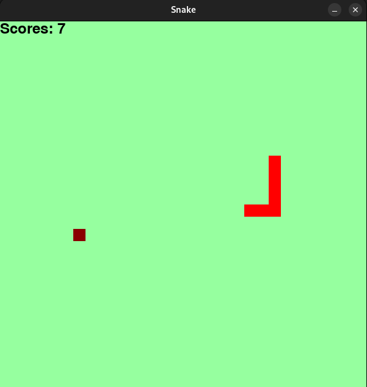

# SnakePy
SnakePy é um jogo da cobrinha simples criado em Python com o Pygame.



## Como Jogar
- Para controlar a cobra, utilize as teclas direcionais (cima, baixo, esquerda, direita) do teclado.
- A cobra deve coletar os itens de comida para crescer e ganhar pontos.
- Evite colidir com as bordas da janela ou com o próprio corpo da cobra.

## Instalação
Certifique-se de ter o Python, Pip, Pygame e o AudioPlayer instalados. Para instalar as dependências execute o comando abaixo:
```bash
pip install pygame audioplayer PyGObject
```

## Executando o Jogo
1. Clone este repositório:
```bash
git clone https://github.com/JoaoSantos2007/SnakePy.git
```
2. Navegue até o diretório do jogo:
```bash
cd SnakePy
```
3. Execute o jogo:
```bash
python main.py
```

## Contribuindo
Contribuições são bem-vindas! Se você quiser contribuir com melhorias, novos recursos ou correções de bugs, sinta-se à vontade para abrir uma issue ou enviar um pull request.

## Autor
João Pedro Tomaz dos Santos - [JoaoSantos2007](https://github.com/JoaoSantos2007)

## Licença
Este projeto está licenciado sob a [Licença MIT](LICENSE).
